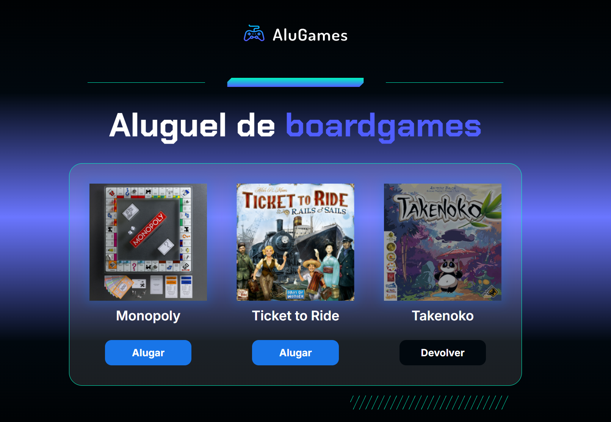
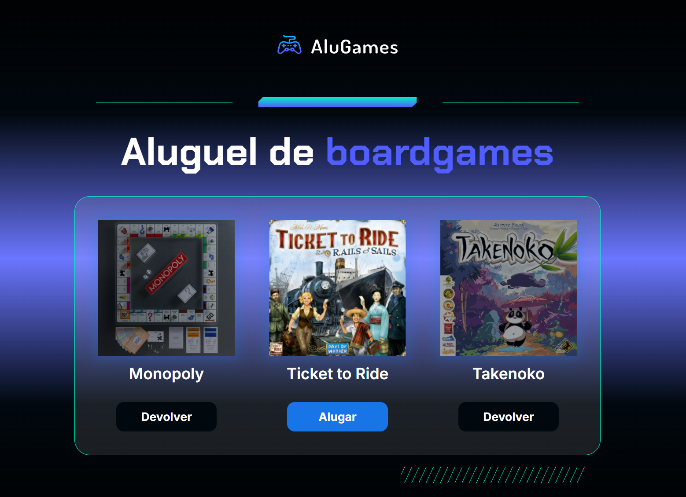
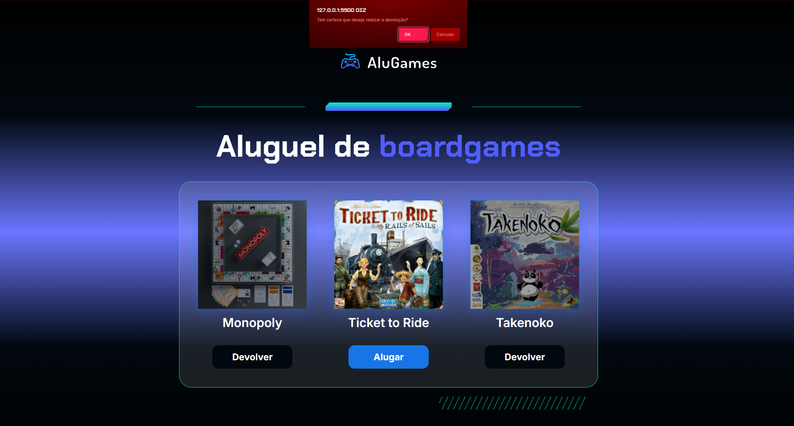
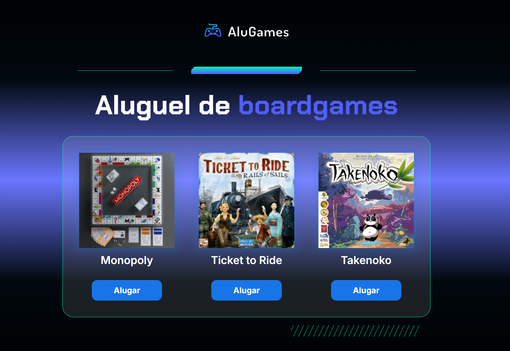
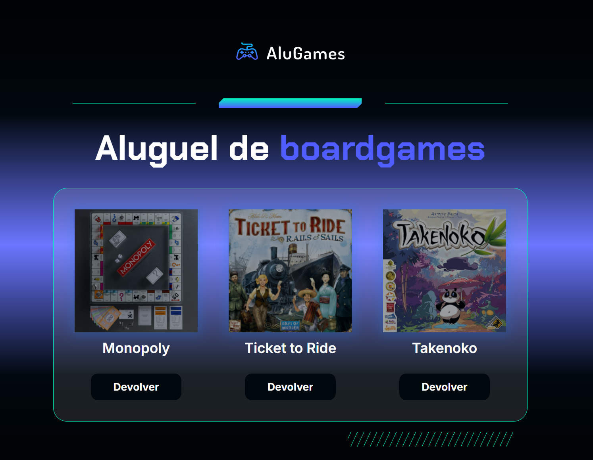

# 🎮 Alugames – Sistema de Aluguel de Jogos

---

## Este projeto simula o aluguel e devolução de jogos em uma página HTML. Ao clicar nos botões de cada jogo, o status visual é alterado para indicar se está alugado ou disponível.

---

## 🧩 Funcionalidades Implementadas

- **Aluguel e devolução de jogos** com confirmação via `confirm()`  
- **Alteração dinâmica** de estilo e texto dos botões  
- **Contador de jogos alugados** exibido no console  
- **Entrada de números via prompt** e ordenação crescente  

---

## 💡 Lógica do Código

### Função `alterarStatus(id)`

- Localiza o jogo clicado pelo ID  
- Verifica se o jogo está alugado  
- Se sim, pede confirmação para devolução  
- Se não, altera o status para alugado  
- Atualiza o estilo da imagem e botão  

---

## 🛠️ Tecnologias Utilizadas

- 📄 **HTML**  
- 🟨 **JavaScript (puro)**  
- 🎨 **CSS**  
- 🧱 **VS Code**

---

## 📦 Como Usar

- Abra o arquivo `index.html` em seu navegador  
- Clique em **"Alugar"** ou **"Devolver"** nos jogos disponíveis  
- Observe as alterações visuais e o log no console  

---

## 📸 Exemplos de Execução

*Tela inicial do programa.*

*Alugando o jogo.*

*Confirmação para devolver o jogo.*

*Tela com todos os jogos disponíveis.*

*Tela com todos os jogos indisponíveis.*

---

## ✏️ Autor

**Kauan Da S. Terrão**  
[Meu GitHub](https://github.com/KauanTerrao)
