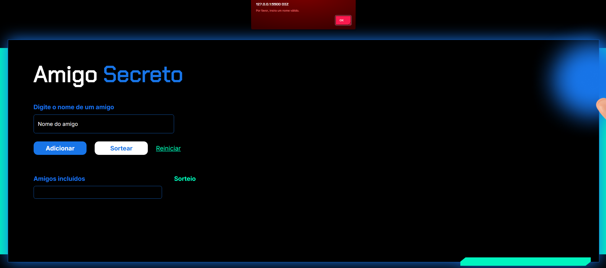
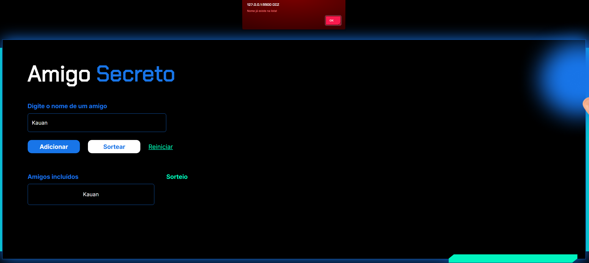
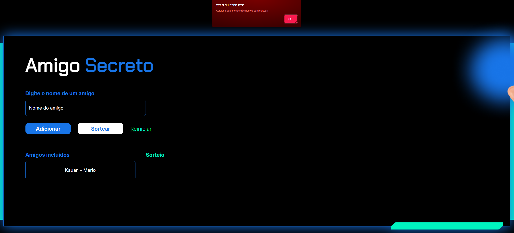

# 🎁 Amigo Secreto: Sorteador de Amigos

---

## Este projeto utiliza uma página HTML para sua execução. Ele coleta os nomes das pessoas que serão sorteadas, verifica se há pelo menos 4 participantes para realizar o sorteio e permite incluir múltiplas pessoas, bem como limpar completamente a lista de nomes.

---

## 🧩 Funcionalidades Implementadas

- **Inclusão de participantes** (nomes digitados pelo usuário)  
- **Validação de entrada** (nome vazio ou repetido)  
- **Atualização dinâmica** da lista e dos resultados do sorteio  
- **Limpeza da lista** de participantes  

---

## 💡 Lógica do Código

### A função principal `adicionar()` realiza as seguintes etapas:

- Coleta o nome do amigo  
- Verifica se o campo está vazio ou se o nome já foi incluído anteriormente  
- Adiciona o nome à lista de participantes  
- Atualiza a exibição da lista na página HTML  

### A função auxiliar `sortear()` realiza as seguintes etapas:

- Verifica se há pelo menos 4 nomes na lista  
- Clona a lista original para evitar alterações durante o sorteio  
- Chama a função `embaralhar()` que executa o [Algoritmo de Fisher-Yates](https://raullesteves.medium.com/algoritmo-de-fisher-yates-para-embaralhamento-de-arrays-ba13a0542e88)  
- Percorre a lista embaralhada e forma os pares  
- Exibe os resultados do sorteio na página HTML  

---

## 🛠️ Tecnologias Utilizadas

- 📄 **HTML**  
- 🟨 **JavaScript (puro)**  
- 🧱 **VS Code**  
- 🎨 **CSS**

---

## 📦 Como Usar

- Abra o arquivo `index.html` em seu navegador  
- Digite o nome da pessoa no campo "Nome do amigo" e clique em **"Adicionar"**  
- Após incluir os participantes, clique em **"Sortear"**  
- Para limpar a lista, clique em **"Reiniciar"**

---

## 📸 Exemplos de Execução

  
*Tela inicial do programa.*

  
*Tela após a inclusão de um amigo.*

  
*Tela após a exclusão dos nomes.*

  
*Alerta ao tentar adicionar um nome vazio.*

  
*Alerta ao tentar adicionar um nome já existente.*

  
*Alerta ao tentar sortear com menos de 4 participantes.*

---

## ✏️ Autor

**Kauan da S. Terrão**  
[Meu GitHub](https://github.com/KauanTerrao)